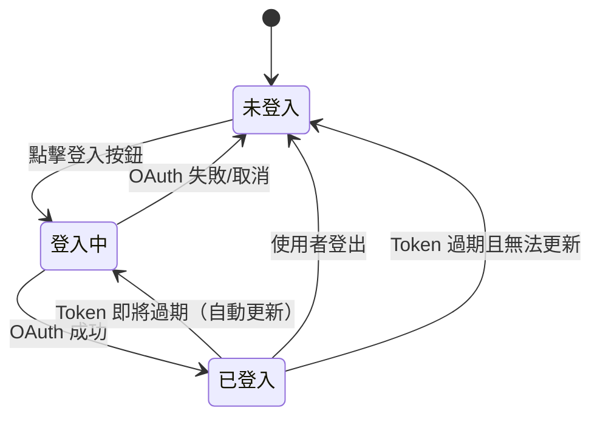
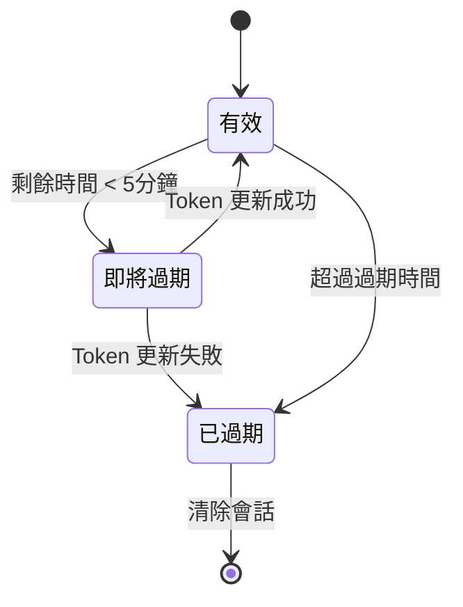

# 資料模型：登入記帳主頁功能

**日期**: 2025-11-16  
**專案**: money-manager  
**功能**: 001-login-home

## 概述

本文件定義登入記帳主頁功能的核心資料模型，包括實體定義、欄位規格、關聯關係、驗證規則和狀態轉換。

---

## 實體 1: 使用者 (User)

### 描述

代表已透過社群平台登入的使用者帳號，儲存使用者基本資訊和認證狀態。

### 欄位定義

| 欄位名稱 | 類型 | 必填 | 預設值 | 描述 |
|---------|------|-----|-------|------|
| `id` | String (UUID) | ✅ | - | 使用者唯一識別碼（Supabase Auth UID） |
| `email` | String | ✅ | - | 使用者電子郵件地址 |
| `displayName` | String? | ❌ | null | 使用者顯示名稱 |
| `photoUrl` | String? | ❌ | null | 使用者頭像 URL |
| `authProvider` | AuthProvider (Enum) | ✅ | - | 登入提供商（GOOGLE/FACEBOOK） |
| `createdAt` | DateTime | ✅ | NOW() | 帳號建立時間 |
| `updatedAt` | DateTime | ✅ | NOW() | 最後更新時間 |

### Dart 類別定義

```dart
// lib/features/auth/data/models/user_model.dart
import 'package:freezed_annotation/freezed_annotation.dart';

part 'user_model.freezed.dart';
part 'user_model.g.dart';

@freezed
class UserModel with _$UserModel {
  const factory UserModel({
    required String id,
    required String email,
    String? displayName,
    String? photoUrl,
    required AuthProvider authProvider,
    required DateTime createdAt,
    required DateTime updatedAt,
  }) = _UserModel;

  factory UserModel.fromJson(Map<String, dynamic> json) =>
      _$UserModelFromJson(json);
}
```

### 資料庫 Schema (Supabase)

```sql
CREATE TABLE users (
  id UUID PRIMARY KEY REFERENCES auth.users(id) ON DELETE CASCADE,
  email TEXT NOT NULL UNIQUE,
  display_name TEXT,
  photo_url TEXT,
  auth_provider TEXT NOT NULL CHECK (auth_provider IN ('GOOGLE', 'FACEBOOK')),
  created_at TIMESTAMPTZ DEFAULT NOW() NOT NULL,
  updated_at TIMESTAMPTZ DEFAULT NOW() NOT NULL
);

-- 自動更新 updated_at 的觸發器
CREATE OR REPLACE FUNCTION update_updated_at_column()
RETURNS TRIGGER AS $$
BEGIN
  NEW.updated_at = NOW();
  RETURN NEW;
END;
$$ LANGUAGE plpgsql;

CREATE TRIGGER update_users_updated_at
  BEFORE UPDATE ON users
  FOR EACH ROW
  EXECUTE FUNCTION update_updated_at_column();

-- RLS 政策
ALTER TABLE users ENABLE ROW LEVEL SECURITY;

CREATE POLICY "Users can view own data"
  ON users FOR SELECT
  USING (auth.uid() = id);

CREATE POLICY "Users can update own data"
  ON users FOR UPDATE
  USING (auth.uid() = id);

CREATE POLICY "Users can insert own data"
  ON users FOR INSERT
  WITH CHECK (auth.uid() = id);
```

### 驗證規則

| 規則 | 驗證邏輯 | 錯誤訊息 |
|-----|---------|---------|
| Email 格式 | 符合 RFC 5322 email 格式 | "電子郵件格式不正確" |
| Email 唯一性 | 在 users 表格中唯一 | "此電子郵件已被註冊" |
| AuthProvider 值域 | 必須為 GOOGLE 或 FACEBOOK | "不支援的登入方式" |
| Display Name 長度 | 如有值，長度 1-50 字元 | "名稱長度必須在 1-50 字元之間" |

### 關聯關係

- **一對多 Session**: 一個使用者可擁有多個會話（多裝置登入）
- **一對一 UserPreference** (未來): 使用者偏好設定（尚未實作）

---

## 實體 2: 會話 (Session)

### 描述

代表使用者在特定裝置上的登入狀態，包含 JWT token 和會話元資料。每個裝置維護獨立會話，允許多裝置同時登入。

### 欄位定義

| 欄位名稱 | 類型 | 必填 | 預設值 | 描述 |
|---------|------|-----|-------|------|
| `id` | String (UUID) | ✅ | gen_random_uuid() | 會話唯一識別碼 |
| `userId` | String (UUID) | ✅ | - | 關聯的使用者 ID（外鍵） |
| `deviceId` | String | ✅ | - | 裝置唯一識別碼 |
| `deviceName` | String? | ❌ | null | 裝置名稱（如 "iPhone 13 Pro"） |
| `deviceType` | String | ✅ | - | 裝置類型（ios/android） |
| `accessToken` | String | ✅ | - | Supabase JWT 存取 Token |
| `refreshToken` | String | ✅ | - | Supabase 更新 Token |
| `expiresAt` | DateTime | ✅ | - | Token 過期時間 |
| `lastActivityAt` | DateTime | ✅ | NOW() | 最後活動時間 |
| `createdAt` | DateTime | ✅ | NOW() | 會話建立時間 |

### Dart 類別定義

```dart
// lib/features/auth/data/models/session_model.dart
import 'package:freezed_annotation/freezed_annotation.dart';

part 'session_model.freezed.dart';
part 'session_model.g.dart';

@freezed
class SessionModel with _$SessionModel {
  const factory SessionModel({
    required String id,
    required String userId,
    required String deviceId,
    String? deviceName,
    required String deviceType,
    required String accessToken,
    required String refreshToken,
    required DateTime expiresAt,
    required DateTime lastActivityAt,
    required DateTime createdAt,
  }) = _SessionModel;

  factory SessionModel.fromJson(Map<String, dynamic> json) =>
      _$SessionModelFromJson(json);
}

extension SessionModelX on SessionModel {
  /// 檢查會話是否已過期
  bool get isExpired => DateTime.now().isAfter(expiresAt);

  /// 檢查會話是否即將過期（5分鐘內）
  bool get isExpiringSoon =>
      expiresAt.difference(DateTime.now()).inMinutes < 5;
}
```

### 資料庫 Schema (Supabase)

```sql
CREATE TABLE sessions (
  id UUID PRIMARY KEY DEFAULT gen_random_uuid(),
  user_id UUID NOT NULL REFERENCES auth.users(id) ON DELETE CASCADE,
  device_id TEXT NOT NULL,
  device_name TEXT,
  device_type TEXT NOT NULL CHECK (device_type IN ('ios', 'android')),
  access_token TEXT NOT NULL,
  refresh_token TEXT NOT NULL,
  expires_at TIMESTAMPTZ NOT NULL,
  last_activity_at TIMESTAMPTZ DEFAULT NOW() NOT NULL,
  created_at TIMESTAMPTZ DEFAULT NOW() NOT NULL,
  UNIQUE(user_id, device_id)
);

-- 索引優化
CREATE INDEX idx_sessions_user_id ON sessions(user_id);
CREATE INDEX idx_sessions_device_id ON sessions(device_id);
CREATE INDEX idx_sessions_expires_at ON sessions(expires_at);

-- 自動清理過期會話（每小時執行一次）
CREATE OR REPLACE FUNCTION cleanup_expired_sessions()
RETURNS void AS $$
BEGIN
  DELETE FROM sessions WHERE expires_at < NOW() - INTERVAL '1 day';
END;
$$ LANGUAGE plpgsql;

-- RLS 政策
ALTER TABLE sessions ENABLE ROW LEVEL SECURITY;

CREATE POLICY "Users can view own sessions"
  ON sessions FOR SELECT
  USING (auth.uid() = user_id);

CREATE POLICY "Users can insert own sessions"
  ON sessions FOR INSERT
  WITH CHECK (auth.uid() = user_id);

CREATE POLICY "Users can update own sessions"
  ON sessions FOR UPDATE
  USING (auth.uid() = user_id);

CREATE POLICY "Users can delete own sessions"
  ON sessions FOR DELETE
  USING (auth.uid() = user_id);
```

### 驗證規則

| 規則 | 驗證邏輯 | 錯誤訊息 |
|-----|---------|---------|
| ExpiresAt 未來時間 | `expiresAt` > 當前時間 | "會話過期時間必須為未來時間" |
| DeviceId 不為空 | `deviceId` 非空字串 | "裝置識別碼不可為空" |
| UserId 存在 | `userId` 在 users 表格中存在 | "使用者不存在" |
| Token 不為空 | `accessToken` 和 `refreshToken` 非空 | "Token 不可為空" |
| 裝置唯一性 | (userId, deviceId) 組合唯一 | "此裝置已有活動會話" |

### 關聯關係

- **多對一 User**: 多個會話屬於一個使用者

---

## 實體 3: 登入提供商 (AuthProvider)

### 描述

列舉類型，定義支援的社群登入平台。用於標識使用者的登入方式，並在會話過期後記住使用者偏好。

### 值域定義

| 值 | 描述 | 對應平台 |
|----|------|---------|
| `GOOGLE` | Google 帳號登入 | Google OAuth 2.0 |
| `FACEBOOK` | Facebook 帳號登入 | Facebook Login |

### Dart 列舉定義

```dart
// lib/features/auth/data/models/auth_provider_model.dart
enum AuthProvider {
  @JsonValue('GOOGLE')
  google,
  
  @JsonValue('FACEBOOK')
  facebook;

  /// 顯示名稱（用於 UI）
  String get displayName {
    switch (this) {
      case AuthProvider.google:
        return 'Google';
      case AuthProvider.facebook:
        return 'Facebook';
    }
  }

  /// 品牌色彩（用於按鈕）
  Color get brandColor {
    switch (this) {
      case AuthProvider.google:
        return const Color(0xFF4285F4); // Google 藍
      case AuthProvider.facebook:
        return const Color(0xFF1877F2); // Facebook 藍
    }
  }

  /// 從字串轉換
  static AuthProvider fromString(String value) {
    return AuthProvider.values.firstWhere(
      (e) => e.name.toUpperCase() == value.toUpperCase(),
      orElse: () => throw ArgumentError('Unknown auth provider: $value'),
    );
  }
}
```

### 使用情境

1. **登入時記錄**: 使用者使用 Google 登入時，User.authProvider 設為 GOOGLE
2. **會話過期提示**: 會話過期時，UI 突出顯示上次使用的登入方式
3. **分析與追蹤**: 統計各登入方式的使用率

---

## 狀態轉換

### 使用者狀態機



### 會話狀態機



### 狀態處理邏輯

```dart
// lib/features/auth/domain/entities/auth_state.dart
sealed class AuthState {
  const AuthState();
}

/// 未登入狀態
class Unauthenticated extends AuthState {
  final AuthProvider? lastUsedProvider; // 記住上次使用的登入方式
  
  const Unauthenticated({this.lastUsedProvider});
}

/// 登入中狀態
class Authenticating extends AuthState {
  final AuthProvider provider;
  
  const Authenticating(this.provider);
}

/// 已登入狀態
class Authenticated extends AuthState {
  final User user;
  final Session session;
  
  const Authenticated({
    required this.user,
    required this.session,
  });
}

/// 認證錯誤狀態
class AuthenticationError extends AuthState {
  final String message;
  final AuthProvider? attemptedProvider;
  
  const AuthenticationError({
    required this.message,
    this.attemptedProvider,
  });
}
```

---

## 資料流程

### 登入流程

```
1. User 點擊 Google 登入按鈕
   ↓
2. AuthStateProvider 呼叫 signInWithGoogle()
   ↓
3. GoogleSignInService 啟動 OAuth 流程
   ↓
4. 取得 Google ID Token 和 Access Token
   ↓
5. 呼叫 Supabase Auth signInWithIdToken()
   ↓
6. Supabase 驗證 Token 並建立 User 和 Session
   ↓
7. 取得 Supabase Session (含 JWT)
   ↓
8. SessionRepository 記錄會話到 sessions 表格
   ↓
9. LocalStorageService 儲存 Token 到 Secure Storage
   ↓
10. AuthStateProvider 更新狀態為 Authenticated
    ↓
11. UI 導向首頁
```

### 自動登入流程

```
1. APP 啟動
   ↓
2. AuthStateProvider.build() 執行
   ↓
3. LocalStorageService 讀取 Access Token
   ↓
4. 如有 Token，呼叫 Supabase Auth recoverSession()
   ↓
5. Supabase 驗證 Token 是否有效
   ↓
6. 如有效，更新 lastActivityAt
   ↓
7. AuthStateProvider 更新狀態為 Authenticated
   ↓
8. UI 導向首頁
   
   如 Token 無效或不存在 → 導向登入頁
```

### 登出流程

```
1. User 點擊登出按鈕
   ↓
2. AuthStateProvider 呼叫 signOut()
   ↓
3. SessionRepository 刪除當前裝置的會話記錄
   ↓
4. Supabase Auth 呼叫 signOut()
   ↓
5. LocalStorageService 清除 Token（保留 lastAuthProvider）
   ↓
6. AuthStateProvider 更新狀態為 Unauthenticated
   ↓
7. UI 導向登入頁
```

---

## 資料完整性

### 外鍵約束

```sql
-- Session.userId 必須參考 User.id
ALTER TABLE sessions
  ADD CONSTRAINT fk_sessions_user_id
  FOREIGN KEY (user_id) REFERENCES users(id)
  ON DELETE CASCADE;
```

### 唯一性約束

```sql
-- User.email 必須唯一
ALTER TABLE users ADD CONSTRAINT uk_users_email UNIQUE (email);

-- (User.id, Device.id) 組合必須唯一
ALTER TABLE sessions ADD CONSTRAINT uk_sessions_user_device UNIQUE (user_id, device_id);
```

### 檢查約束

```sql
-- AuthProvider 必須為 GOOGLE 或 FACEBOOK
ALTER TABLE users
  ADD CONSTRAINT ck_users_auth_provider
  CHECK (auth_provider IN ('GOOGLE', 'FACEBOOK'));

-- DeviceType 必須為 ios 或 android
ALTER TABLE sessions
  ADD CONSTRAINT ck_sessions_device_type
  CHECK (device_type IN ('ios', 'android'));

-- ExpiresAt 必須為未來時間
ALTER TABLE sessions
  ADD CONSTRAINT ck_sessions_expires_at
  CHECK (expires_at > created_at);
```

---

## 測試資料範例

### 使用者範例

```json
{
  "id": "550e8400-e29b-41d4-a716-446655440000",
  "email": "user@example.com",
  "displayName": "測試使用者",
  "photoUrl": "https://lh3.googleusercontent.com/a/default-user",
  "authProvider": "GOOGLE",
  "createdAt": "2025-11-16T10:00:00Z",
  "updatedAt": "2025-11-16T10:00:00Z"
}
```

### 會話範例

```json
{
  "id": "660e8400-e29b-41d4-a716-446655440001",
  "userId": "550e8400-e29b-41d4-a716-446655440000",
  "deviceId": "770e8400-e29b-41d4-a716-446655440002",
  "deviceName": "iPhone 13 Pro",
  "deviceType": "ios",
  "accessToken": "eyJhbGciOiJIUzI1NiIsInR5cCI6IkpXVCJ9...",
  "refreshToken": "refresh_token_string...",
  "expiresAt": "2025-11-16T11:00:00Z",
  "lastActivityAt": "2025-11-16T10:30:00Z",
  "createdAt": "2025-11-16T10:00:00Z"
}
```

---

## 遷移腳本

### 初始化資料庫

```sql
-- 001_create_users_table.sql
CREATE TABLE users (
  id UUID PRIMARY KEY REFERENCES auth.users(id) ON DELETE CASCADE,
  email TEXT NOT NULL UNIQUE,
  display_name TEXT,
  photo_url TEXT,
  auth_provider TEXT NOT NULL CHECK (auth_provider IN ('GOOGLE', 'FACEBOOK')),
  created_at TIMESTAMPTZ DEFAULT NOW() NOT NULL,
  updated_at TIMESTAMPTZ DEFAULT NOW() NOT NULL
);

CREATE TRIGGER update_users_updated_at
  BEFORE UPDATE ON users
  FOR EACH ROW
  EXECUTE FUNCTION update_updated_at_column();

ALTER TABLE users ENABLE ROW LEVEL SECURITY;
CREATE POLICY "Users can view own data" ON users FOR SELECT USING (auth.uid() = id);
CREATE POLICY "Users can update own data" ON users FOR UPDATE USING (auth.uid() = id);
CREATE POLICY "Users can insert own data" ON users FOR INSERT WITH CHECK (auth.uid() = id);

-- 002_create_sessions_table.sql
CREATE TABLE sessions (
  id UUID PRIMARY KEY DEFAULT gen_random_uuid(),
  user_id UUID NOT NULL REFERENCES users(id) ON DELETE CASCADE,
  device_id TEXT NOT NULL,
  device_name TEXT,
  device_type TEXT NOT NULL CHECK (device_type IN ('ios', 'android')),
  access_token TEXT NOT NULL,
  refresh_token TEXT NOT NULL,
  expires_at TIMESTAMPTZ NOT NULL CHECK (expires_at > created_at),
  last_activity_at TIMESTAMPTZ DEFAULT NOW() NOT NULL,
  created_at TIMESTAMPTZ DEFAULT NOW() NOT NULL,
  UNIQUE(user_id, device_id)
);

CREATE INDEX idx_sessions_user_id ON sessions(user_id);
CREATE INDEX idx_sessions_device_id ON sessions(device_id);
CREATE INDEX idx_sessions_expires_at ON sessions(expires_at);

ALTER TABLE sessions ENABLE ROW LEVEL SECURITY;
CREATE POLICY "Users can view own sessions" ON sessions FOR SELECT USING (auth.uid() = user_id);
CREATE POLICY "Users can insert own sessions" ON sessions FOR INSERT WITH CHECK (auth.uid() = user_id);
CREATE POLICY "Users can update own sessions" ON sessions FOR UPDATE USING (auth.uid() = user_id);
CREATE POLICY "Users can delete own sessions" ON sessions FOR DELETE USING (auth.uid() = user_id);
```

---

**文件版本**: 1.0.0  
**最後更新**: 2025-11-16  
**下一步**: 實作 Repository 層和 Domain 實體
